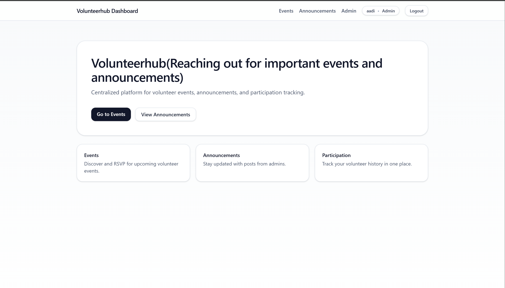
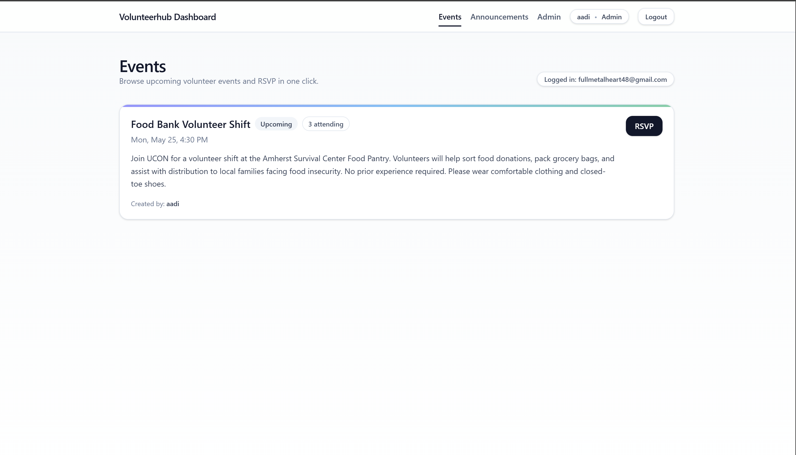
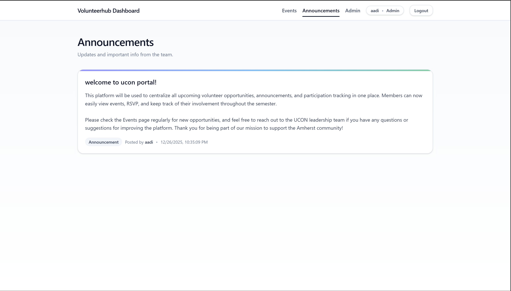
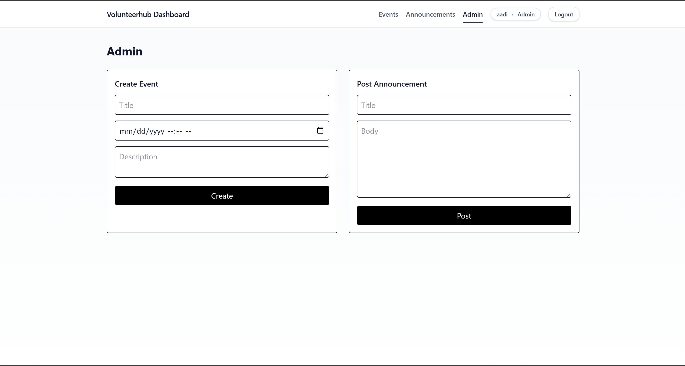

# VolunteerHub 🚀  
*A modern platform for managing volunteer events, announcements, and participation*

VolunteerHub is a full-stack web application built to **centralize and simplify volunteer coordination**.  
It provides a clean dashboard for users to discover events, RSVP, and stay updated, while giving admins powerful tools to manage events and announcements — all in one place.

This project is designed with **real-world production practices**, focusing on clean UI, scalable architecture, and role-based access.

---

## ✨ Features

### 👥 User Features
- Browse upcoming volunteer events
- RSVP to events in one click
- View announcements posted by admins
- Track personal participation history
- Secure authentication and session handling

### 🛠 Admin Features
- Create and manage volunteer events
- Post announcements and updates
- View attendance and participation data
- Role-based access control (Admin vs Member)

---

## 🧱 Tech Stack

### Frontend
- **React + Vite**
- **Tailwind CSS** (modern, responsive UI)
- **Framer Motion** (smooth animations)
- **Axios** (API communication)

### Backend
- **Node.js + Express**
- **MongoDB + Mongoose**
- **JWT Authentication**
- RESTful API design

---

## 🎯 Why VolunteerHub?

Many organizations rely on scattered tools like Google Forms, Sheets, and emails to manage volunteers.  
VolunteerHub solves this by offering a **single, centralized platform** that improves:

- Communication clarity  
- Attendance tracking  
- Admin efficiency  
- User experience  

The result is a cleaner workflow for both organizers and volunteers.

---

## 🖥️ Screenshots

### Home Dashboard

### Events Page

### Announcements

### Admin Panel

🚀 Getting Started
Prerequisites

Node.js (v18+ recommended)

npm

MongoDB (local or cloud)

Run Backend
cd backend
npm install
npm run dev

Backend runs on:

http://localhost:5000

Run Frontend
cd frontend
npm install
npm run dev

Frontend runs on:

http://localhost:5173

🔐 Environment Variables

Create a .env file in the backend:

MONGO_URI=your_mongodb_connection_string
JWT_SECRET=your_secret_key

Create a .env file in the frontend (if needed):

VITE_API_URL=http://localhost:5000

🧠 What I Learned

Designing full-stack apps with clean separation of concerns

Implementing role-based authentication

Building responsive UIs with Tailwind

Debugging real-world build and tooling issues (Vite + Tailwind)

Structuring projects for scalability and maintainability

📌 Future Improvements

Email notifications for RSVPs

Event analytics dashboard

Mobile-first optimizations

Admin moderation tools

Deployment with CI/CD

